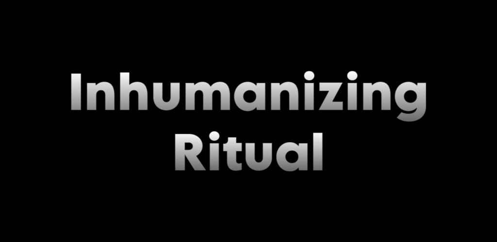

# 

Adds a new ritual to inhumanize your pawns!

**Commissioned in the RimWorld Mod Market**

## Features

Adds a new ritual to the game that allows you to inhumanize your pawns without the inhumanization precept.

Low quality rituals can cause pawns to fall into a coma for a long time.

## Existing Saves

This mod should be safe to add or remove from saves.

## Bugs and Requests

Let me know if there are any bugs or requests, I'll happily do my best to fix them up!

Open to contributions and suggestions!
